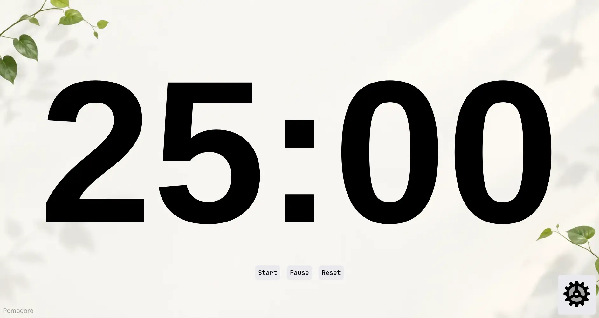

# Pomodoro

This is a very simple pomodoro timer website. All the data is stored locally in the browser.

    

It consist of two pages:-

- `index` The main pomodoro timer
- `settings` To change the timer duration and font

## To use it

Just go to [pomo-dun.vercel.app](https://pomo-dun.vercel.app/) or [pomo.x44.diy](https://pomo.x44.diy/)[x44 is my site btw] or clone this repo and open the index.html file.
